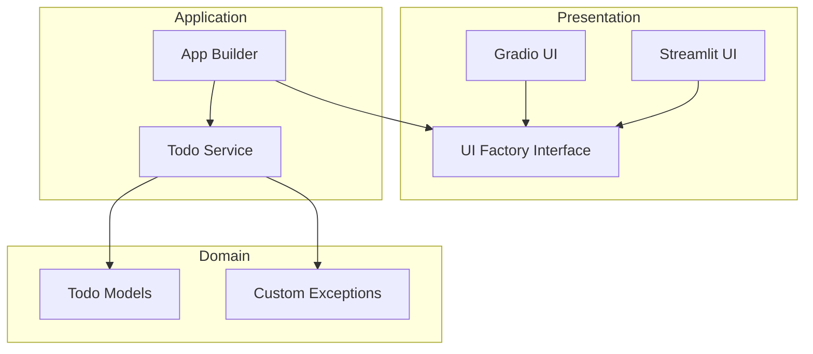

# AgnosticPyUI

A production-ready Python web template demonstrating **Clean Architecture** and the **Abstract Factory Pattern**.

## 🎯 Objective
Completely decouple business logic from the presentation layer. The same interface definition runs interchangeably on **Streamlit** or **Gradio** without modifying the core logic.

## 🏗️ Architecture


## 🚀 Getting Started

### 1. Create a Virtual Environment
It's recommended to use a virtual environment to isolate the project's dependencies:

```bash
# Windows
python -m venv .venv
.\.venv\Scripts\activate

# macOS / Linux
python3 -m venv .venv
source .venv/bin/activate
```

### 2. Install Dependencies
```bash
pip install -r requirements.txt
```

### 3. Run the Application

**Run with Gradio:**
```bash
python main.py --ui gradio
```

**Run with Streamlit:**
```bash
python main.py --ui streamlit
```

## 🛠️ Project Structure
- `domain/`: Core business models and exceptions (Zero dependencies).
- `application/`: Service layer orchestrating domain logic.
- `ui_core/`: Abstract factory interfaces and framework-specific implementations.
- `main.py`: Entry point for choosing the UI at runtime.

## ✅ Quality Standards
- **Strict Typing:** Pass `mypy --strict`.
- **Linting:** Compliant with `ruff` and `black`.
- **Docs:** Google Style docstrings throughout.
